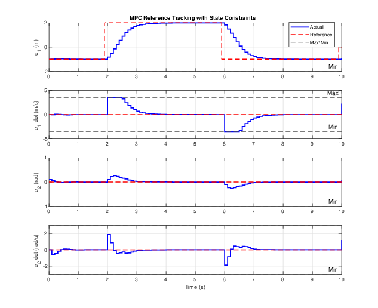
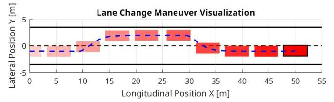

# MPC_AMR
This repository contains code for the final project of Model Predictive Control SC42125 based on lane following for an autonomous vehicle. The MPC toolbox used is MPT3 and YALMIP.

## MPC Reference Tracking with State Feedback

For autonomous cars, accurate trajectory generation and following are crucial, especially in high-risk scenarios at high speeds.  
A reference tracking MPC was developed to demonstrate capabilities such as performing lane changes or overtaking maneuvers.

---

### Target State and Input Computation

When given the output reference \( y_{\text{ref}} \), the optimal target state and input \((x_{\text{ref}}, u_{\text{ref}})\) are computed offline for every reference set point by solving:

\[
(x_{\text{ref}}, u_{\text{ref}})(y_{\text{ref}}) \in \arg\min_{x_r, u_r} J(x_r, u_r)
\]
subject to:
\[
\begin{bmatrix}
I - A & -B \\
C & 0
\end{bmatrix}
\begin{bmatrix}
x_r \\
u_r
\end{bmatrix}
=
\begin{bmatrix}
0 \\
y_{\text{ref}}
\end{bmatrix}
\]
\[
(x_r, u_r) \in Z, \quad Cx_r \in Y
\]

---

### Cost Function Reformulation

The MPC stage cost and terminal cost are reformulated to incorporate deviation from the reference state and input:

Stage cost:
\[
\ell(x, u) = (x - x_{\text{ref}})^{\top} Q (x - x_{\text{ref}}) + (u - u_{\text{ref}})^{\top} R (u - u_{\text{ref}})
\]
Terminal cost:
\[
V_f(x(N)) = (x(N) - x_{\text{ref}})^{\top} P (x(N) - x_{\text{ref}})
\]

---

### Simulation Results

- The MPC successfully tracks the reference without violating state and input constraints.
- A simulation of a lane change scenario illustrates the real-world applicability and benefits of this MPC approach.

)  
*Closed-loop response for reference tracking.*

  
*Visualization of a car lane change using MPC reference tracking.*

